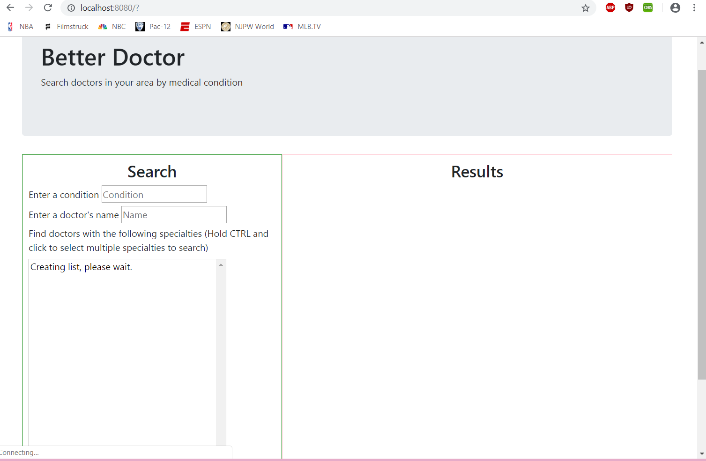
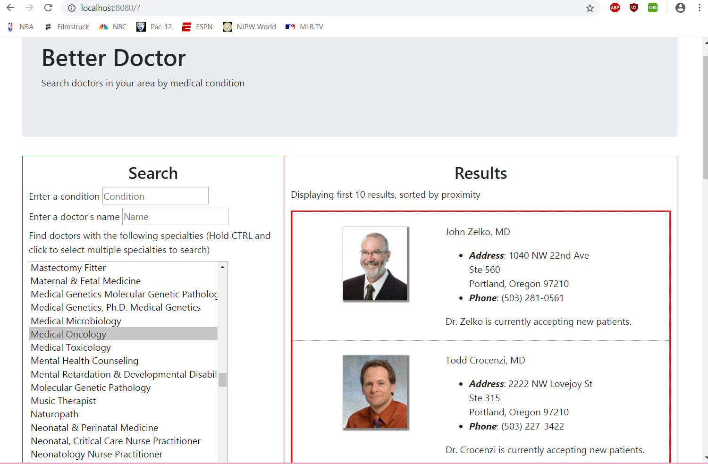

# Better Doctor

### _Created By_ **Joe Friesen**

## Description

This application will return information about doctors based on location or medical condition as given by the user, utilizing the BetterDoctor.com API. Submitted for Epicodus code review on 10/12/2018.

## Screenshots





## Technologies Employed

* [BetterDoctor API](https://developer.betterdoctor.com)
* HTML
* JavaScript
* jQuery
* CSS
* SASS Preprocessing
* Bootstrap
* Webpack

## Installation Instructions

* *Clone this repository:*
  * In terminal, enter the following:
```
$ cd ~/desktop
$ git clone https://github.com/josephfriesen/better-doctor.git
$ cd better-doctor
```
* *Create API key:*
  * Go to https://developer.betterdoctor.com/
  * Follow the instructions to sign up and get your unique API key.
  * In the root directory */better-doctor*, create and open a file named *.env*.
  * In *.env*, write the following:
```
exports.apiKey = ***YOUR UNIQUE API KEY GOES HERE (WITHOUT THE ASTERISKS)***
```
* In terminal, enter
```
$ npm run build
```

### Legal

Copyright (c) 2018 [Joseph Friesen](mailto:friesen.josephc@gmail.com)
